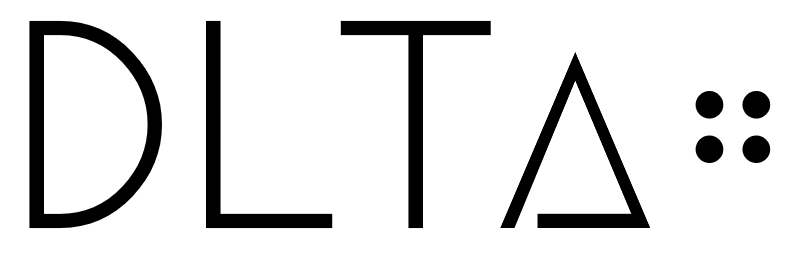
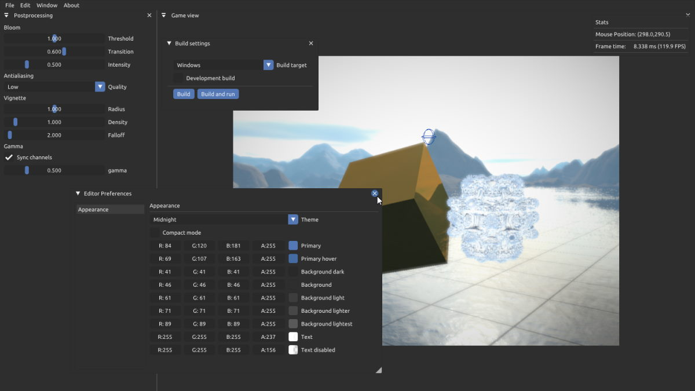

---

DltΔ (delta) is a game engine written in C++,
this is my first big openGL project

## Features

- 2D and 3D renderer
- Postprocessing stack
- Editor GUI with support for theming as well as custom windows
- Immediate mode gizmo system

## Libraries used

- GLFW: window provider
- GLAD: openGL loader
- GLM: vector math
- stb_image: Image loader
- Imgui(docking): Editor GUI

Some of the code in this repository is heavily inspired by https://learnopengl.com/
